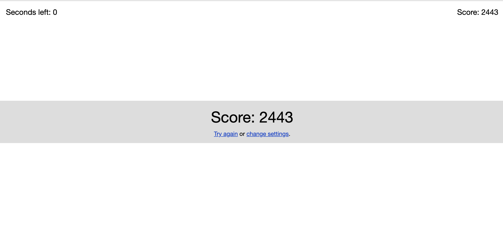

# AutoZetamac

A Python script to automatically play the arithmetic game on [zetamac.com](https://arithmetic.zetamac.com/).

## Introduction

AutoZetamac is an automation script that solves arithmetic problems on Zetamac's arithmetic game. 
My personal best without the script is 97, however, the script can score in the thousands.

